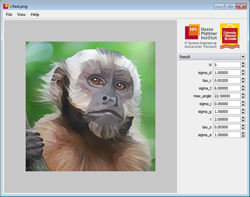

# cefabs

Image and Video Abstraction by Coherence-Enhancing Filtering

This program implements an automatic image and video abstraction technique based on adaptive line integral convolution and directional shock filtering. It was written by [Jan Eric Kyprianidis](http://www.kyprianidis.com/) while working as a research scientist for the [computer graphics systems group](http://www.hpi3d.de/) of the [Hasso-Plattner-Institut](http://www.hpi.uni-potsdam.de/) at the University of Potsdam, Germany.



## Requirements
Building requires [CMake](http://www.cmake.org/), [CUDA](http://developer.nvidia.com/cuda-toolkit-40), and the [Qt cross platform toolkit](http://qt-project.org). Recommended CUDA version is >= 4.0 and recommended Qt version is 4.7.3. The program has been tested to successfully build with Visual Studio 2008 on Windows, Qt Creator 2.2.1 on Mac OS X and the default toolchain on Ubuntu 11.04. See build.bat/build.sh to get started. Video processing requires [FFmpeg](http://www.ffmpeg.org/), but is optional.

## Building:

Windows / Visual Studio:
```
mkdir build
cd build
cmake ..
devenv /build Release cefabs.sln
```

Mac OS X / Linux:
```
mkdir build
cd build
cmake ..
make
```

Precompiled binaries for Windows require the Visual Studio 2008 runtimes:
* [Microsoft Visual C++ 2008 SP1 Redistributable Package (x86)](http://www.microsoft.com/downloads/en/details.aspx?familyid=A5C84275-3B97-4AB7-A40D-3802B2AF5FC2)

* [Microsoft Visual C++ 2008 SP1 Redistributable Package (x64)](http://www.microsoft.com/downloads/en/details.aspx?FamilyID=BA9257CA-337F-4B40-8C14-157CFDFFEE4E)


## Related Publications
* Kyprianidis, J. E., & Kang, H. (2011). [Image and Video Abstraction by Coherence-Enhancing Filtering](http://www.kyprianidis.com/p/eg2011/). Computer Graphics Forum 30(2), pp. 593-602. (Proceedings Eurographics 2011)
